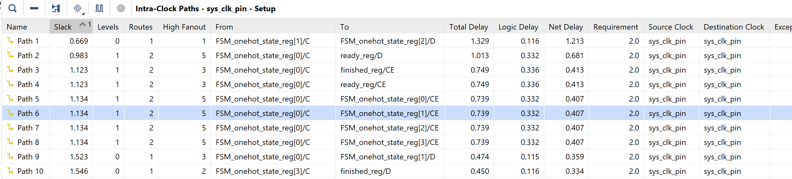
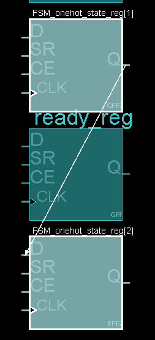
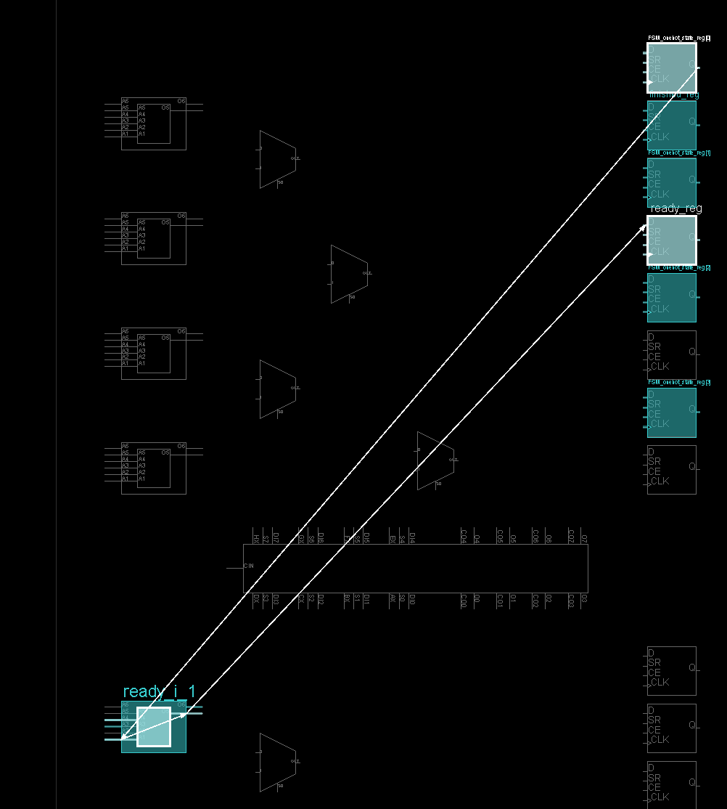
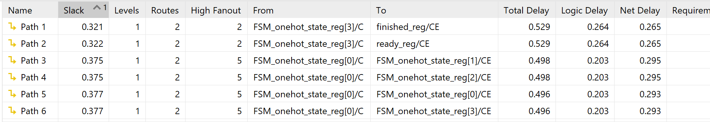
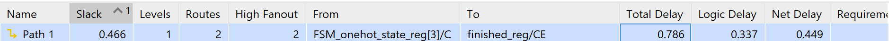

# Advent of FPGA 2025

A collection of Verilog solutions based on Advent of Code 2025 problems implemented for [Advent of FPGA](https://blog.janestreet.com/advent-of-fpga-challenge-2025/). My target hardware is KV260 (K26C SOM) although I don't really have any board. To explain, I chose CocoTB in this challenge simply because I used it before, I see that I need to process input at first, and I just need the final answer, I don't think anything better than CocoTB in this context.

## How to run

Prerequisites before run:
- Icarus Verilog (iverilog) version 11.0 (stable)
- Python 3.10
- CocoTB v1.9.2
- Make

All solutions follow a consistent build system using Makefiles. To run any day's solution:

```bash
cd day_X
make
```

**Input Handling**: Raw input data is stored in `input.txt` files.

## Problems Overview

### Day 1: [Secret Entrance](https://adventofcode.com/2025/day/1)
- **Part 1**: This problem is quite boring, but it gave me two surprises. I simply do arithmetic operations on every cycle based on pipelining, use a technique called forwarding to avoid data hazard and used the modulo operator (%) - which is god damn expensive. However, the critical path is not that modulo, how surprising it is. You can see the attached picture below, which shows the top 10 critical paths when I set the frequency to 100MHz at first.



The critical paths look great, right? But the interesting part here is that there are only two paths over 1ns, and they aren't arithmetic paths, what I expected(?). That made me curious, so I looked into the implementation. Let's see what I found:

<p align="center">
  
  
</p>

Now you can see the critical path is long because ready_reg lies between FSM_onehot_state_reg[1]/C and FSM_onehot_state_reg[2]/D. Meanwhile, the second most critical path is a long diagonal route - it looks like it could be optimized by using a closer element. So, I cranked the clock down to 1ns to see what I could get.

Now for the second surprise: I got 0.529ns for the critical path!?!?!



Well, that wasn't exactly good news once I realized I had reached the pulse width limit of the BUFGCE, which is 1.379ns (~725MHz).


That is not something I can handle because it is a silicon limit. So, I finally just reverted it to 725MHz. 



- **Part 2**: It is a twin of Part 1. The only difference is the division used to count the "crosses" during cycles and a minor modification in the logic to detect the zero-crossing.
- **Critical Path**: 0.786ns 
- **Maximum Clock Frequency**: 724.6 MHz
- **Execution Time**: 4202 cycles (~3303ns)

### Day 2: [Gift Shop](https://adventofcode.com/2025/day/2)
- **Part 1**: this solution takes advantage of the fact that all the input ranges have start and end numbers with roughly the same number of digits, they never differ by more than one digit (which tbh helps me saving a lot of effort to address that case =). Instead of doing expensive division and modulo operations in hardware, I use binary-coded decimal (BCD) where each digit takes exactly 4 bits, making it easy to grab individual digits through bit-shifting. The main idea is to split each number in half and work with just the first half, I count from the start's first half to the end's first half, sum them up, then multiply by the right power of 10 (using shifts instead of actual multiplication since shifting is way faster, but the trade-off is a few more cycles). After that, I add the sum again to account for the second half. I also check the second halves of the start and end numbers to adjust the boundaries if needed like if the start number's second half is bigger than its first half, I bump up the first half by one. Actually, using shifts instead of multiply saves about 0.2 ns in the hardware implementation.
- **Part 2**: It is basically brute force approach which is not optimal (I guess?) but I still trying to use approach of part 1 in this. 

### Day 3: [Lobby](https://adventofcode.com/2025/day/3)
- **Part 1**: 
- **Part 2**: 

### Day 4: [Printing Department](https://adventofcode.com/2025/day/4)
- **Part 1**:
- **Part 2**: 

### Day 5: [Cafeteria](https://adventofcode.com/2025/day/5)
- **Part 1**:
- **Part 2**:

### Day 6: [Trash Compactor](https://adventofcode.com/2025/day/6)
- **Part 1**: 
- **Part 2**:

### Day 7: [Laboratories](https://adventofcode.com/2025/day/7)
- **Part 1**: 
- **Part 2**:

### Day 8: [Playground](https://adventofcode.com/2025/day/8)
- **Part 1**: 
- **Part 2**: 

### Day 9: [Movie Theater](https://adventofcode.com/2025/day/9) 
- **Part 1**: 
- **Part 2**: 

### Day 10: [Factory](https://adventofcode.com/2025/day/10)
- **Part 1**: 
- **Part 2**: 

### Day 11: [Reactor](https://adventofcode.com/2025/day/11)
- **Part 1**:
- **Part 2**:

### Day 12: [Christmas Tree Farm](https://adventofcode.com/2025/day/12)
- **Part 1**: 
- **Part 2**: 

### File Structure (per day)
```
day_X/
├── input.txt                   # Raw problem input
├── convert_input.py            # Input preprocessing script
├── *.mem                       # Memory initialization files
├── *_part1.v                   # Part 1 Verilog implementation
├── *_part2.v                   # Part 2 Verilog implementation
├── test_day_X.py               # Cocotb test file (supporting print result)
└── Makefile                    # Build configuration
```

