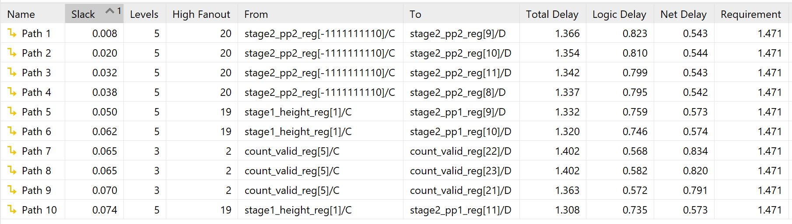

# Advent of FPGA 2025

A collection of Verilog solutions based on Advent of Code 2025 problems implemented for [Advent of FPGA](https://blog.janestreet.com/advent-of-fpga-challenge-2025/). My target hardware is KV260 (K26C SOM) although I don't really have any board. To explain, I chose CocoTB in this challenge simply because I used it before, I see that I need to process input at first, and I just need the final answer, I don't think anything better than CocoTB in this context.

## How to run

Prerequisites before run:
- Icarus Verilog (iverilog) version 11.0 (stable)
- Python 3.10
- CocoTB v1.9.2
- Make

All solutions follow a consistent build system using Makefiles. To run any day's solution:

```bash
cd day_X
make
```

**Input Handling**: Raw input data is stored in `input.txt` files.

## Problems Overview

### Day 1: [Secret Entrance](https://adventofcode.com/2025/day/1)

**Part 1**: Pretty straightforward problem, but I ran into two fun surprises while optimizing.

I built a simple 3-stage pipeline with data forwarding to handle the dial rotations. The modulo operator (%) is usually expensive, so I expected that to be the bottleneck. But when I set an initial target of 500MHz, the timing report showed something weird:


Only two paths over 1ns, and neither of them were the arithmetic I was worried about. So I dug into the synthesis results to see what was going on:

<p align="center">
  
  
</p>

Turns out the critical path is actually in the FSM - the `ready` signal creates a long combinational path between state registers. The second-longest path is just bad routing that could probably be improved with better placement.

I got curious and cranked things up to 1GHz to see what would happen. The critical path dropped to 0.529ns, which seemed great until I realized I'd hit the BUFGCE pulse width limit at 1.379ns (~725MHz):


That's a hard silicon constraint, not something I can optimize around. So the final design just targets 725MHz.


**Optimizations:**
- 3-stage pipeline: input parsing → modulo reduction → position calculation
- Data forwarding to avoid stalls between operations
- Modulo by 100 gets optimized by the synthesizer into efficient subtract-and-compare logic
- Separate paths for left/right rotation to reduce mux depth
- 3-cycle pipeline flush to drain in-flight operations before finishing

**Part 2**: Almost identical to Part 1. Main differences are adding a division to count how many times we cross zero during a rotation (e.g., R1000 crosses zero 10 times), and tweaking the crossing detection logic to catch passes through zero mid-rotation instead of just at the end.

**Additional optimizations:**
- Division by 100 to count complete revolutions (basically the inverse of the modulo)
- Single-cycle logic to detect zero crossings based on direction and position
- Running accumulator for total crossings across the pipeline

**Performance:**
- **Critical Path**: 0.786ns
- **Max Frequency**: 724.6 MHz  
- **Execution Time**: 4,202 cycles (~5.8µs)

### Day 2: [Gift Shop](https://adventofcode.com/2025/day/2)

**Part 1**: This problem asks us to find "invalid" product IDs in ranges - specifically, IDs that are some digit sequence repeated exactly twice (like `123123` or `6464`).

The key insight is that instead of checking every number in a range individually, we can calculate the sum of all invalid IDs mathematically. For a range with even-length IDs, we can split each number into two halves and look for cases where the halves match.

The pipeline takes each range and:
1. Converts the start/end from BCD (Binary-Coded Decimal) to binary
2. Splits each number at the midpoint into high and low halves
3. Finds the range of "first halves" that could produce valid repeating numbers
4. Uses the arithmetic series formula to sum all matching IDs: `sum = n * (first + last) / 2`
5. Multiplies by `10^(half_length) + 1` to reconstruct the actual repeated numbers

For example, in range `11-22`, the first halves are `1` and `2`, giving us numbers `11` and `22`. The sum is `(2 * (1+2) / 2) * 11 = 33`.

**Optimizations:**
- BCD input format allows easy digit extraction without division
- 14-stage pipeline with tree adders for BCD-to-binary conversion
- Arithmetic series formula avoids iterating through every number
- Pipelined multipliers for the final reconstruction step
- Special handling for odd-length ranges (they get rounded up to even length)

**Performance:**
- **Critical Path**: 2.848ns
- **Max Frequency**: 333MHz 
- **Pipeline Depth**: 14 stages
- **Execution Time**: 120 cycles (~0.36 µs)

**Part 2**: It is basically brute force approach which is not optimal (I guess?) but I still trying to use approach of part 1 in this. 

### Day 3: [Lobby](https://adventofcode.com/2025/day/3)

**Part 1**: Conceptually simple problem: for each line of digits, pick two digits (in order) that form the largest possible 2-digit number, then sum across all lines. But mapping this cleanly to hardware ended up being more interesting than expected.

My first instinct was to buffer the whole line and do some kind of selection logic, but that felt wasteful. Instead, I treated each bank as a stream of digits and tried to maintain the best 2-digit combination on the fly.

The core idea is that at any point, I only need to remember the current best pair and compare it against combinations involving the next digit. So the whole design becomes a streaming max-pair problem instead of a sorting problem.

I built a deep pipeline where each stage consumes one digit (4 bits) and conditionally updates the best pair seen so far. Each stage compares the incoming digit against the existing pair and decides whether replacing one or both digits would yield a larger 2-digit number.

By the time the pipeline finishes scanning a line, it has already converged to the maximum valid pair.

One tricky part was merging partial results. When combining two candidate pairs (a, b) and (c, d), you can’t just compare ab and cd. You have to consider all ordered combinations:
ab, ac, ad, bc, bd, cd.

I implemented this as a small combinational comparison tree that picks the maximum legal pair while preserving order. It looks ugly on paper, but synthesizes nicely I guess.

After that, converting the final digit pair into a decimal number is trivial:
10a + b, implemented as (a << 3) + (a << 1) + b to avoid multipliers.

Finally, each bank’s result is accumulated into a running sum. A counter tracks how many banks have completed, and once the last one exits the pipeline, the finished flag is asserted.

**Optimizations:**
- BCD input format allows easy digit extraction without division
- One digit consumed per pipeline stage
- Comparison tree instead of nested conditionals
- Shift-add decimal conversion instead of multiplication
- One bank processed per cycle after pipeline fill
- Fixed latency regardless of digit values

**Performance:**
- **Critical Path**: 1.349ns
- **Max Frequency**: 650MHz 
- **Pipeline Depth**: 11 stages
- **Execution Time**: 2614 cycles (~4.02µs)


**Part 2**:  This is not much harder version of Part 1 but hard to optimize (one reason is I want to use 32-bit data in so the number of cycle each state is different). Instead of picking 2 digits to form the largest 2-digit number, I now need to pick 12 digits from each bank to form the largest 12-digit number.
The challenge is figuring out which 12 digits to keep. The key insight is that I want to build the number left-to-right, always trying to put the biggest possible digit in each position. But there's a constraint: I can only pick a digit if there are still enough digits left after it to complete our 12-digit number.
For example, if I're looking at a bank like 987654321111111 and I've already selected 10 digits, I need at least 2 more digits. So I can only consider digits that have at least 2 digits remaining after them (including themselves).
The algorithm works like this: scan through the digits one by one, and whenever I find a digit that's larger than what I currently have in a position AND there are enough digits remaining, I update our selection. If I replace an earlier position with a better digit, I throw away everything after it and start fresh from there.
My implementation uses a three-stage pipelined architecture:
Stage 1 (Input Buffering): Uses ping pong buffers that alternate roles. While one buffer receives incoming digits from the input stream (8 BCD digits per 32-bit word), the other buffer feeds digits to Stage 2 for processing. When Stage 1 finishes filling a buffer and Stage 2 finishes reading the previous buffer, they swap roles. This keeps the pipeline moving without stalls.

Stage 2 (Digit Selection): This is where the main logic lives. It maintains a 48-bit register that holds our current best 12-digit number (4 bits per digit). As each new digit arrives, the stage asks: "Can this digit improve my number?"
It checks all 12 positions from left to right:

Position 0: Is this digit bigger than my first digit? And are there at least 12 digits left (including this one)?
Position 1: If not position 0, is this digit bigger than my second digit? And are there at least 11 digits left?
...and so on through position 11.

When I find a position where the new digit is better AND I have enough digits remaining, I put the new digit there and clear everything to the right (since I're building a new number from this point forward).
For the example 987654321111111: I scan left to right, keep the 9, then keep the 8, then the 7, and so on. 

Stage 3 (BCD to Binary Conversion): The 12 selected digits are in BCD format (4 bits each), but I need a standard binary number for arithmetic. This stage converts by processing one digit at a time: multiply the current result by 10 and add the next digit. After 12 iterations, I have our binary number.
The multiplication by 10 is implemented as (value << 3) + (value << 1) which is equivalent to value × 8 + value × 2 = value × 10, avoiding hardware multipliers.

I scan left-to-right, so I naturally prioritize larger digits in higher-value positions
The "remaining digits" check ensures I can always complete a valid 12-digit number
Once I place a large digit early, I only consider digits that come after it (maintaining order)
The cascaded comparison structure efficiently finds the best position for each new digit

**Optimizations:**
- Double-buffering enables overlapped input/processing
- BCD input format simplifies digit extraction
- Shift-add multiplication avoids dedicated multiplier units

**Performance:**
- **Critical Path**: 3.658ns
- **Max Frequency**: 250MHz 
- **Pipeline Depth**: 3 stages
- **Execution Time**: 21430 cycles (~85.72µs)


### Day 5: [Cafeteria](https://adventofcode.com/2025/day/5)

**Part 1**: My goal here was to maximize throughput while maintaining a clean pipeline structure. I used a 32-bit input interface with AXI-like handshaking (valid/ready signals). My solution is a bit tricky as I preloaded ranges into program :) but generally it is quite simple and straightforword.

Since each ingredient ID is 50 bits wide, the testbench streams each ID over 2 clock cycles (32 bits + 18 bits). The module continuously accepts input while simultaneously processing previously received IDs through the comparison pipeline.

The pipeline has 4 stages (not counting input reception):
- 1 stage to assemble the complete 50-bit ID
- 1 stage for parallel range comparisons (182 comparisons)
- 1 stage for AND operations to determine range membership
- 1 stage for result accumulation

**Optimizations:**
- Parallel comparison across all 182 ranges using generate blocks
- Single-cycle OR reduction to check any-range membership

**Performance:**
- **Critical Path**: 1.979ns
- **Max Frequency**: ~455 MHz
- **Execution Time**: 2,006 cycles (~4.41µs)

**Part 2**: The problem shifts from checking individual IDs against ranges to computing the total count of unique IDs covered by all ranges. This requires merging overlapping and adjacent ranges before counting. In addition, this implimentation is not something realistic so I don't show the performance here.

The solution uses a pure computational approach with no streaming input - all 182 ranges are loaded from memory at initialization. The algorithm proceeds through three phases:

Pipeline Stages:
1. SORT: Bubble sort to order ranges by start position
   - Optimized with early termination when no swaps occur
   - Compares adjacent ranges and swaps when out of order
2. MERGE: Combine overlapping/adjacent ranges
   - Walks through sorted ranges sequentially
   - Extends current range when overlap detected (start ≤ previous_end + 1)
   - Marks merged ranges as invalid to avoid double-counting
3. SUM: Count total IDs across all valid merged ranges
   - Adds up (end - start + 1) for each valid range

**Key Design Decisions:**
- In-place merging by extending ranges and marking absorbed ranges as invalid
- The `+1` check handles both overlapping ranges and adjacent ranges that should merge


### Day 6: [Trash Compactor](https://adventofcode.com/2025/day/6)
- **Part 1**: 
- **Part 2**:

### Day 8: [Playground](https://adventofcode.com/2025/day/8)
- **Part 1**: 
- **Part 2**: 

### Day 12: [Christmas Tree Farm](https://adventofcode.com/2025/day/12)

My goal here was to minimize the critical path as much as possible to push the clock frequency. I used a 32-bit input interface with AXI-like handshaking (valid/ready signals).

Since the actual present shapes don't matter for this puzzle (we only care about the counts), the testbench ignores them completely and just feeds in the region width, height, and six present counts. Each region needs 8×8 = 64 bits of data, which takes 2 clock cycles to stream in.

The pipeline has 6 stages (not counting input reception):
- 1 stage to load the data
- 3 stages for arithmetic operations  
- 2 stages for comparison and accumulating results



**Optimizations:**
- Bit shifts instead of multiplication wherever possible
- Pipelined multipliers for area calculations
- Tree adders to reduce addition latency

**Performance:**
- **Critical Path**: 1.402ns
- **Max Frequency**: 680 MHz  
- **Execution Time**: 2,009 cycles (~2.96µs)

### File Structure (per day)
```
day_X/
├── input.txt                   # Raw problem input
├── *_part1.v                   # Part 1 Verilog implementation
├── *_part2.v                   # Part 2 Verilog implementation
├── test_day_X.py               # Cocotb test file (supporting print result)
└── Makefile                    # Build configuration
```

